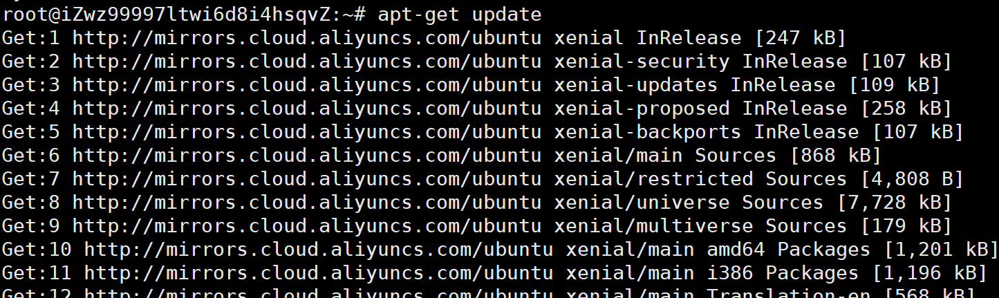
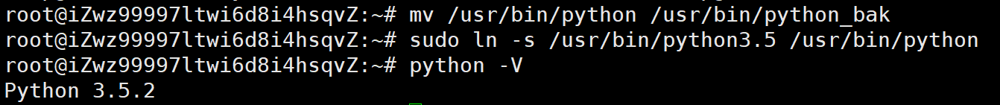
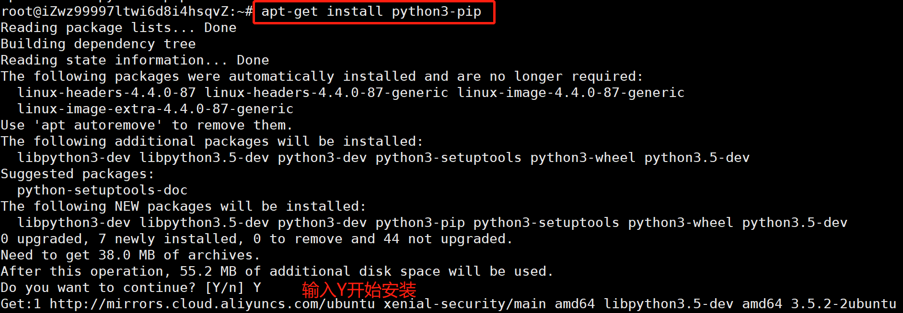

## Ubuntu安装pyhton3、pip3

项目仓库地址：[https://github.com/jiyouliang/UbuntuPython](https://github.com/jiyouliang/UbuntuPython)

### 1、检查包并安装

	sudo apt-get update           # 更新源
	sudo apt-get install python3.5 #安装python3.5，默认阿里云Ubuntu16.04已安装python3.5

### 2、pyhton命令连接到python3.5

	sudo mv /usr/bin/python3 /usr/bin/python_bak # 备份
	sudo ln -s /usr/bin/python3.5 /usr/bin/python3  #更改连接

### 3、安装pip3

	sudo apt-get install python3-pip

### 4、安装django环境（python web开发环境）

pip install django==1.8.2

### 5、相关软件下载

FileZilla Client：[https://filezilla-project.org/](https://filezilla-project.org/)

xshell ：[https://pan.baidu.com/s/1_RW1EbZKwUSBaiGYLE_0qQ](https://pan.baidu.com/s/1_RW1EbZKwUSBaiGYLE_0qQ)
